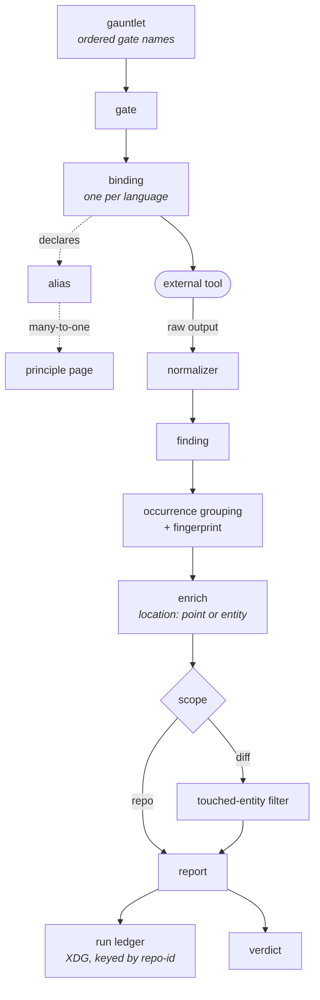

# togi — a tour of the language

[CONTEXT.md](../CONTEXT.md) defines the vocabulary and is the only place that
does. This page does not repeat it. It exists because a flat list of 41 terms
is hard to hold in your head, and it answers the three questions the list
can't: *which of these are real today*, *what order do they happen in*, and
*which pairs am I going to mix up*.

Every term below links to its section in the glossary on first use.

## Start here: a third of the language is not built yet

This is the single most confusing thing about the glossary, and nothing in it
says so. 15 of its 41 terms name behaviour that does not exist in the code —
they were defined up front so the design would stay coherent, and their
packages exist as one-line doc stubs.

| Real today | Designed, not built |
|---|---|
| engineer · developer · operator | integrity gate · seal |
| gauntlet · gate · binding · normalizer | triage · action plan · batch |
| cost class · fix policy *(declared, not acted on)* | flywheel · brief · adapter |
| finding · occurrence · fingerprint · snippet · severity | landing · waiver |
| touched-entity scope · location · errored | merge-ready · stalemate · rail · ratchet |
| principle page · alias · eject | addendum |
| runner · gitcmd · config tier · repo-id · run ledger · unverified | |

If you are reading a term from the right-hand column, you are reading a
promise, not a description. `internal/triage`, `internal/flywheel`, and
`internal/adapter` are two lines each. The CLI today is `togi run`,
`togi status`, and `togi wiki show|lint|eject`.

Verdicts are the sharpest case: **unverified** is reachable now, and
**merge-ready** is not reachable at all, because it requires the seal.

## Follow one run

What actually happens when you type `togi run`, in the order it happens.

A [**gauntlet**](../CONTEXT.md#the-gauntlet) is just an ordered list of
[**gate**](../CONTEXT.md#the-gauntlet) names. Each gate owns one
[**binding**](../CONTEXT.md#the-gauntlet) per language, and the binding is what
knows the concrete details: which tool to run, its pinned version, and which
[**normalizer**](../CONTEXT.md#the-gauntlet) parses its output. Gates come from
one of three [**config tiers**](../CONTEXT.md#verdicts-rails-and-state) —
shipped, operator, or repository — and nothing is ever written into the repo
you are judging.

togi resolves the target repository's [**repo-id**](../CONTEXT.md#verdicts-rails-and-state)
first, because every piece of external state is keyed by it. Then gates run in
parallel, each external process going through the single
[**runner**](../CONTEXT.md#execution) primitive; git goes through
[**gitcmd**](../CONTEXT.md#execution). Nothing else in togi spawns a process.

Each tool's raw output becomes [**findings**](../CONTEXT.md#findings) through
its normalizer. A finding that fires identically several times in a file is one
finding with [**occurrences**](../CONTEXT.md#findings), not many findings. Each
one gets a [**fingerprint**](../CONTEXT.md#findings) — a line-independent
identity hashed from its [**snippet**](../CONTEXT.md#findings) — which is why
editing around a finding doesn't make it look new.

Then two things happen that are easy to confuse, and they are separate steps:

1. **Enrichment** applies the gate's [**location**](../CONTEXT.md#findings).
   A `point` finding keeps its own line; an `entity` finding is widened to its
   enclosing declaration.
2. **Scoping** applies the gate's scope. A `diff` gate keeps only findings
   whose range overlaps a changed line — that overlap rule is
   [**touched-entity scope**](../CONTEXT.md#findings). A `repo` gate skips this
   step entirely.

Location changes the *range*; scope decides whether the range is *filtered*.
They are independent, which is why a whole-repo gate still enriches.

A gate whose tool crashed, is missing, timed out, or emitted garbage is
[**errored**](../CONTEXT.md#findings) — a different channel from a gate that
found problems, and it never suppresses a healthy sibling. Everything the run
produced lands in the [**run ledger**](../CONTEXT.md#verdicts-rails-and-state)
under XDG, and the verdict caps at
[**unverified**](../CONTEXT.md#verdicts-rails-and-state) whenever there's no
green behavioural suite.

Separately, [**principle pages**](../CONTEXT.md#wiki) explain the engineering
practice behind a finding. Bindings declare [**aliases**](../CONTEXT.md#wiki)
mapping many tool rule_ids onto one page, and
[**eject**](../CONTEXT.md#wiki) copies a shipped page into your operator tier
so you can edit it.

## What happens next, once the fix loop exists

Designed, not built — but this is the shape the right-hand column describes.
[**Triage**](../CONTEXT.md#the-fix-loop) turns the collected findings into an
[**action plan**](../CONTEXT.md#the-fix-loop) of
[**batches**](../CONTEXT.md#the-fix-loop). The
[**flywheel**](../CONTEXT.md#the-fix-loop) works that plan one batch at a time —
never two writers in the worktree — handing each batch as a
[**brief**](../CONTEXT.md#the-fix-loop) to a headless agent CLI through the
[**adapter**](../CONTEXT.md#the-fix-loop). A batch commits only when the fast
gates, the integrity gates, and the suite all pass.

## Words that get confused

Every `_Avoid_` pair in the glossary, collected. These are the actual trip
hazards; the reason is usually that the wrong word already means something
else here.

| Say | Not | Because the wrong word means |
|---|---|---|
| gauntlet | pipeline, review | *pipeline* is reserved for the future spec→build arc |
| gate | check, rule, linter | see the `rule` note below |
| finding | issue, violation, error | *error* is a severity level, not a result |
| errored | failed | a *failed* gate sounds like one with findings — different channel, different consequence |
| waiver | suppression | *suppression* is the in-code thing integrity gates count |
| developer, operator | user *(as a noun)* | the adjective is correct — user-visible, user-facing |
| location (point/entity) | point-scoped, entity-scoped | scope is diff/whole-repo; location is a separate axis |
| runner | executor | *executor* names the gate-level orchestration in `run` |
| gitcmd | `exec.Command("git", …)` | every git call declares an isolation policy |

**The `rule` exception.** *rule* is avoided only when it means **gate**. Two
uses are correct and common: a tool's own `rule_id`, which is part of the
findings schema (ADR-0005), and Gherkin's `Rule:` keyword in the acceptance
specs, which is a document heading.

## The model at a glance

## Finding a term in the code

Packages are named for glossary terms, not technical layers (ADR-0012), so the
mapping is direct: read a term, open `internal/<term>`. `finding`, `gate`,
`normalizer`, `enricher`, `wiki`, `repoid`, `config`, `run`, `runner`,
`gitcmd` are all live; `triage`, `flywheel`, and `adapter` are the stubs.

The acceptance specs in [`features/`](../features/README.md) are the other
way in — they describe the same vocabulary as behaviour you can run.
